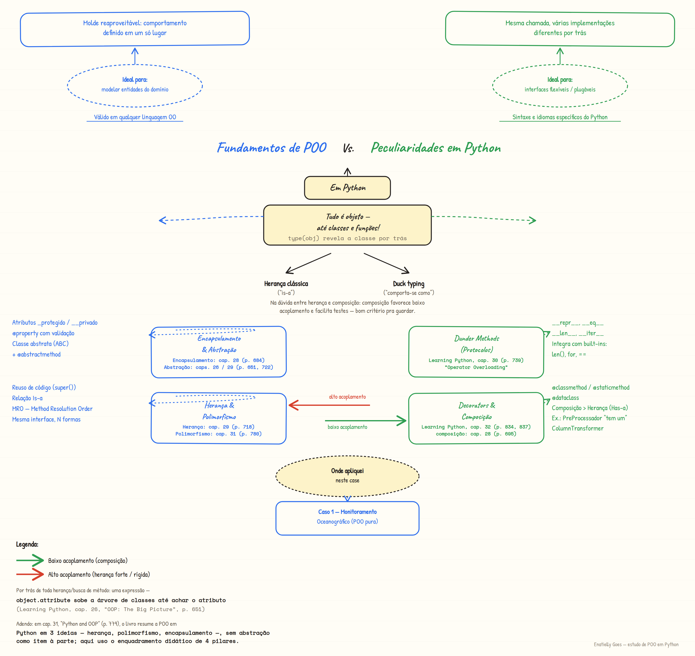

# Orientação a Objetos em Python — Estudo de Caso

Repositório de estudo, criado para consolidar e demonstrar na prática os
quatro pilares da Orientação a Objetos (encapsulamento, abstração, herança e
polimorfismo) em Python, junto com peculiaridades da linguagem (duck typing,
dunder methods, `@property`, `@classmethod`/`@staticmethod`, `@dataclass`).

## Caso 1 — Rede de Monitoramento Oceanográfico

Domínio escolhido de propósito: é a minha área de formação (Oceanografia),
então o exemplo é meu, não um "Animal/Cachorro" genérico de tutorial.

Uma `EstacaoMonitoramento` abstrata define o contrato (`coletar_leitura()`),
e três subclasses (`BoiaOceanografica`, `EstacaoCosteira`, `EstacaoSubmersa`)
implementam esse contrato cada uma à sua maneira. Uma quarta classe,
`SensorCidadaoCientista`, nem herda da hierarquia — e ainda assim funciona
dentro da rede, por **duck typing**.

Conceitos demonstrados: classe abstrata (`ABC`/`@abstractmethod`),
`@property` com validação, `@classmethod` como construtor alternativo,
`@staticmethod`, `@dataclass`, dunder methods (`__repr__`, `__eq__`,
`__len__`, `__iter__`), polimorfismo e duck typing.

```bash
cd caso1_simples
pip install -r requirements.txt
python src/monitoramento_oceanografico.py   # demo
python -m pytest tests/ -v                  # 9 testes
```

## Mapa mental



## Referência usada para revisar os artefatos

*Learning Python: Powerful Object-Oriented Programming* (6ª ed., 2025), de
Mark Lutz e David Ascher (O'Reilly) — especificamente a **Parte VI, "Classes
and OOP"** (p. 649–874), usada para conferir cada conceito aplicado neste
case.

### Os quatro pilares

| Pilar | Capítulo do livro |
|---|---|
| Abstração | Cap. 26 — *OOP: The Big Picture*, seção *Attribute Inheritance Search* (p. 651), e Cap. 29 — *Class Coding Details*, seção *Abstract Superclasses* (p. 722) |
| Encapsulamento | Cap. 28 — *A More Realistic Example*, seção *Coding Methods* (p. 684) |
| Herança | Cap. 26 — *OOP: The Big Picture* (p. 651), e Cap. 29 — *Class Coding Details*, seção *Inheritance* (p. 718) |
| Polimorfismo | Cap. 31 — *Designing with Classes*, seção *Polymorphism Means Interfaces, Not Call Signatures* (p. 780) |

### Outros conceitos usados no case

| Conceito no case | Capítulo do livro |
|---|---|
| Sintaxe básica de classe, atributos, métodos | Cap. 27 — *Class Coding Basics* (p. 661) |
| Composição (`RedeDeMonitoramento` *tem várias* estações, não herda delas) | Cap. 28 — *A More Realistic Example*, seção *Other Ways to Combine Classes: Composites* (p. 695) |
| Dunder methods / operator overloading (`__repr__`, `__eq__`, `__len__`, `__iter__`) | Cap. 30 — *Operator Overloading* (p. 739) |
| Composição vs. herança (*Is-a* × *Has-a* × *Like-a*/delegação) | Cap. 31 — *Designing with Classes* (p. 779–796) |
| `@property`, `@classmethod`, `@staticmethod`, decorators | Cap. 32 — *Class Odds and Ends*, seções *Properties* (p. 834) e *Static and Class Methods* (p. 837) |

## Autoria

Enatielly Goes — [linkedin.com/in/enatielly-goes](https://www.linkedin.com/in/enatielly-goes/)
